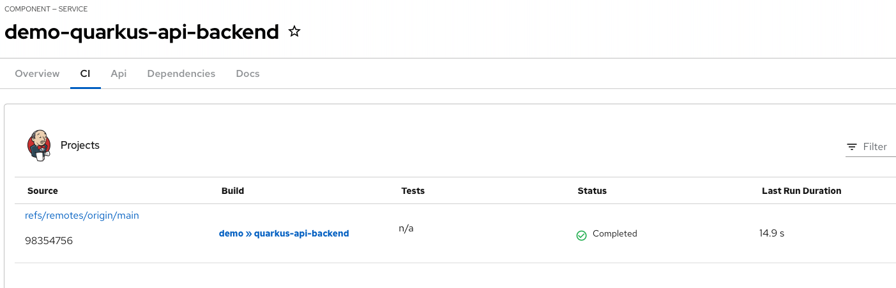

# Red Hat Developer Hub Jenkins Showcase

[Red Hat Developer Hub](https://developers.redhat.com/rhdh/overview) is an enterprise-grade Internal Developer Portal, combined with Red Hat OpenShift, Red Hat Developer Hub allows platform engineering teams to offer software templates, pre-architected and supported approaches to maximize developer skills, ease onboarding, and increase development productivity, and focus on writing great code by reducing friction and frustration for development teams. Red Hat Developer Hub also offers Software Templates to simplify the development process, which can  reduce friction and frustration for development teams, boosting their productivity and increasing an organization's competitive advantage.

Red Hat provides OpenShift Pipelines based on Tekton for CI/CD implementation on OpenShift. Customers who are using OpenShift can utilize the OpenShift Pipelines for integrated CI/CD implementation. 

Jenkins pipeline build strategy is deprecated since OpenShift 4 while OpenShift Jenkins images continue to be supported in OpenShift 4.x. Refers [OpenShift Jenkins support](https://access.redhat.com/solutions/4961581) for more details. However, many organizations are still using Jenkins for their CI/CD engine, this document outlines the necessary steps to enable the Red Hat Developer Hub and Jenkins integration.

> Note: This guide is meant to create a demo environment, many of the configurations are not recommended for production usage.

## Assumptions

The following are the assumptions made to run this demo:
- Jenkins server is running outside of OpenShift.
- Gitlab and Red Hat OpenShift Dev Spaces are readily available.  

## Running a Standalone Jenkins Environment

To simulate an external Jenkins environment, you can run the Jenkins server with the necessary Maven JNPL agent using the following steps with Docker compose file.

> Note: Refer to [github/standalone-jenkins](https://github.com/chengkuangan/standalone-jenkins) for more details

1. Create a `jenkins_home` in your local environment

    ```
    mkdir jenkins_home
    ```

2. Create a file named .env and add the following:

    ```
    JENKINS_HOME_PATH=/home/<change_this>/jenkins_sandbox_home 
    ```

3. Run the Jenkins:

    ```
    sudo docker-compose up -d
    ```

4. Get the password to proceed installation:
    ```
    sudo docker logs jenkins_sandbox | less
    ```

5. Go to http://localhost:8080/ and enter the password. 

> Note: Ideally, an IP address that is accessible by RHDH is a must as you need to configure RHDH with this Jenkins Server

6. Select Install Suggested Plugins, create the admin user and password, and leave the Jenkins URL http://localhost:8080/.

7. Create a folder named `demo`

> Refers details on the Maven JNPL Agent used in this demo at this [README](https://github.com/chengkuangan/standalone-jenkins/blob/main/jnpl-agent/README.md)

### Create Jenkins API Token

1. Goto Jenkins console. Click on the logon user dropdown menu and followed by `Security`. In my case, I am using `admin`

2. Under API Token, click `Add new Token`. Note down the generated token. We need this to configure Jenkins for RHDH Template

3. Click `Save`

## Create GitLab Owner

1. Goto GitLab web console. At the `Groups` landing page and create a group with the following details

    | Fields | Value |
    | --- | --- |
    | Group Name | demo  |
    | Visibility Level | Public |
    
    Accept the default values for other fields and click `Create group` button

## Configure Red Hat Developer Hub

1. The RHDH application configuration is configured using environmental variables, thus we need to include these environmental variables in a `secret`. Create the following `secret` with the respective Jenkins details.

    ```yaml
    data:
      JENKINS_URL: <base64 encoded Jenkins URL>
      JENKINS_USERNAME: <base64 encoded username>
      JENKINS_TOKEN: <base64 encoded token>
    type: Opaque
    ```

2. Update the RHDH application configuration `configmap` to enable Jenkins integration

    ```yaml
    data:
      app-config-rhdh.yaml: |
        integrations:
          jenkins:
            - host: ${JENKINS_URL}
              username: ${JENKINS_USERNAME}
              apiKey: ${JENKINS_TOKEN}
    ```

3. Create or modify existing `configmap` to enable the necessary dynamic plugin

    ```yaml
    kind: ConfigMap
    apiVersion: v1
    metadata:
      name: dynamic-plugins-rhdh
    data:
      dynamic-plugins.yaml: |
        includes:
          - dynamic-plugins.default.yaml
        plugins:
          - package: './dynamic-plugins/dist/backstage-plugin-jenkins-backend-dynamic'
            disabled: false
            pluginConfig:
              jenkins:
                instances:
                - name: default-jenkins
                  baseUrl: ${JENKINS_URL}
                  username: ${JENKINS_USERNAME}
                  apiKey: ${JENKINS_TOKEN}
          - package: './dynamic-plugins/dist/backstage-plugin-jenkins'
            disabled: false
            pluginConfig:
              dynamicPlugins:
                frontend:
                  backstage.plugin-jenkins:
                    mountPoints:
                      - mountPoint: entity.page.ci/cards
                        importName: EntityJenkinsContent
                        config:
                          layout:
                            gridColumn: "1 / -1"
                          if:
                            allOf:
                              - isJenkinsAvailable
    ```
    
4. Modify the developer hub instance to use the `secret` and `configmap` that we have created earlier if not done so

    ```yaml
    apiVersion: rhdh.redhat.com/v1alpha2
    kind: Backstage
    metadata:
      name: developer-hub
      namespace: rhdh
    spec:
      application:
        appConfig:
          configMaps:
            - name: app-config-rhdh
          mountPath: /opt/app-root/src
        dynamicPluginsConfigMapName: dynamic-plugins-rhdh
        extraEnvs:
          envs:
            - name: NODE_TLS_REJECT_UNAUTHORIZED
              value: '0'
          secrets:
            - name: secrets-rhdh
        extraFiles:
          mountPath: /opt/app-root/src
        replicas: 1
        route:
          enabled: true
      database:
        enableLocalDb: true
    ```

5. The Red Hat Developer Hub POD will be restarted automatically. 

## Create the Sample Template

### Duplicate the Sample Template

1. Make a copy of the template in your local directory

    ```
    mkdir /tmp/jenkins-template
    cp showcase/jenkins /tmp/jenkins-template
    ```

2. Modify the `template.yaml` with the correct OCP Apps Domain `ocp_app_domain`

    ```yaml

    steps:
    - id: templateSource
      name: Generating the source code component
      action: fetch:template
      input:
        url: ./skeleton
        targetPath: ./source
        values:
          ocp_app_domain: <ocp apps domain>
      
    ```

3. Create a new repo in your Github


4. Initialize the new content with Git and push it to your GitHub 

    ```bash
    git init
    git add .
    git remote <github repo>
    git commit -m "rhdh jenkins demo"
    git push -u origin main
    ```
### Create the Template

1. Goto RHDH console. 

2. Click on `Create...` > `Register Existing Component`, enter your GitHub repo URL and follow through the wizard to create the template

3. A demo template will be imported as per the following:

    

4. Proceed to create the template and these are the result that you will get

    

5. Repository created at GitLab

    

5. Configure a Jenkins project under the `demo` folder

    

6. Run the Jenkins build and you will see the build information is available at the RHDH catalog

    